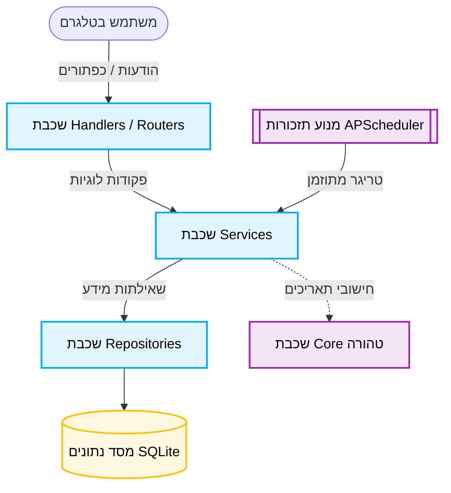

# 🎉 בלי פאדיחות · Birthly

  

בוט טלגרם אישי ומתקדם לניהול ימי הולדת ותאריכים חוזרים, עם תמיכה מלאה בלוח העברי ובלוח הלועזי.
מוסיפים אדם בשלושה צעדים, והבוט דואג לשאר: חישוב מופעים, שליחת תזכורות חכמות מראש, וברכות מוכנות להעתקה. פשוט יותר מלוח שנה, מהיר יותר מאפליקציה, וחי כולו בתוך הטלגרם שלכם.

---

## ✨ פיצ'רים מרכזיים ויכולות חדשות

הפרויקט עבר שדרוגים משמעותיים לאחרונה, וכעת הוא כולל מערכת עשירה של יכולות:

| מאפיין | תיאור |
| :--- | :--- |
| 🗓️ **לוח כפול** | תמיכה מושלמת בלוח העברי והלועזי, כולל טיפול במקרי קצה (ל' חשוון, שנה מעוברת). |
| ⏰ **מנוע חכם** | מבוסס `APScheduler`, מבטיח תזכורת פעם אחת בדיוק (ללא כפילויות) עם "חלון חסד". |
| 📇 **כרטיסי אירוע** | תצוגה עשירה לכל אירוע הכוללת ספירה לאחור, גיל עדכני, וכפתורי פעולה מהירים. |
| 💬 **תוכן מותאם** | התאמה דינמית של טקסטים, הודעות מערכת וברכות לפי מגדר (זכר/נקבה). |
| 💌 **תבניות ברכה** | הצעות לברכות מוכנות מראש המותאמות לסוג האירוע, מוכנות להעתקה מהירה. |
| 💾 **מערכת גיבויים** | ייצוא נתונים ל-JSON, CSV או Excel, ייבוא מהיר, וגיבוי אוטומטי מנוהל. |

---

## 🛠 הטכנולוגיה והארכיטקטורה

Birthly נבנה בסטנדרטים הגבוהים ביותר, תוך הקפדה על הפרדה נוקשה של שכבות (Clean Architecture):



**טכנולוגיות מרכזיות:**
* **Python 3.12** / **aiogram 3.x**
* **SQLAlchemy 2.0 (async)** / **SQLite (WAL)**
* **Alembic** / **APScheduler** / **pyluach**

---

## 🚀 התקנה והרצה מקומית

כדי להריץ את הבוט בסביבת הפיתוח המקומית שלכם:

```bash
# 1. יצירת סביבה וירטואלית והפעלתה
python3.12 -m venv .venv
source .venv/bin/activate

# 2. התקנת תלויות
pip install -r requirements.txt -r requirements-dev.txt

# 3. הגדרות סביבה
cp .env.example .env               
# פתחו את .env והזינו BOT_TOKEN ו-ADMIN_IDS

# 4. מיגרציות
alembic upgrade head

# 5. הפעלה
python -m app.main
```

## 🌐 פריסה (Deployment)

הבוט תוכנן לפריסה קלה ומהירה כ-Service בשרת Linux:

```bash
git clone <repo> /opt/birthly && cd /opt/birthly
bash deploy/install.sh
```

---

## 🏗 מבנה הפרויקט

- `app/core/`: פונקציות הליבה הטכניות. קוד טהור ללא תלות במסד נתונים.
- `app/db/`: מודלים של מסד הנתונים ומחלקות `Repository` שניגשות למידע, תוך הקפדה על סינון מובנה ברמת המשתמש.
- `app/services/`: הלב של הלוגיקה העסקית בפרויקט (Business Logic).
- `app/handlers/`: שכבת הניתוב והתצוגה (aiogram Routers). ללא לוגיקה עסקית או SQL.
- `app/scheduler/`: מנוע התזכורות הראשי וכלל משימות הרקע היומיות.
- `locales/`: מערך התרגום המפריד את הטקסטים מהקוד.

---

> **הערה חשובה למפתחים:** הפרויקט מכיל מסמך [SPEC.md](SPEC.md) המשמש כ-**Source of Truth** הבלעדי. חובה לקרוא אותו לפני כל שינוי בקוד לשמירה על איכות ורמת הפיתוח!
